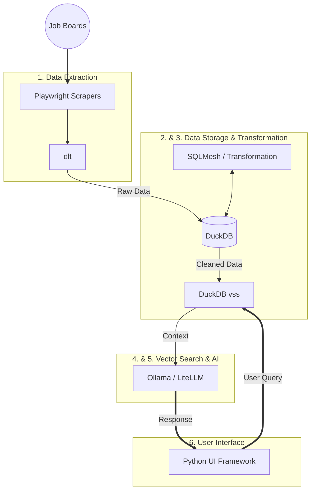

# Architecture

## Purpose

This document explains the basic structure of the Job Market Skill Advisor project. It describes the main parts of the system, what each part is responsible for, and how data flows through the application. This document is meant to help the team stay aligned and to show our current thinking about the system design. The architecture may change as the project develops.

---

## System Overview

The system is designed to collect job postings from online job boards, store them locally, and analyze them to help users understand what skills are in demand. The project follows a simple pipeline-style design where data moves step by step from extraction to analysis and finally to a user interface.

The system focuses on using Python and open-source tools.

---

## High-Level Architecture Diagram

---

## Main Components

### 1. Data Extraction

**What it does**  
This part of the system is responsible for collecting job postings from public job boards.

**How it works**  
- Uses Playwright to load job board web pages
- Uses dlt to organize and store the scraped data

**Output**  
- Raw job posting data stored in a database

---

### 2. Data Storage

**What it does**  
This component stores all job data so it can be queried and processed later.

**How it works**  
- Uses DuckDB as a local database
- Stores both raw scraped data and cleaned data

**Stored Data Includes**
- Job titles and descriptions
- Company names and locations
- Salary details (if available)
- Additional texts for analysis

---

### 3. Data Transformation

**What it does**  
This part cleans and organizes the raw job data so it is easier to analyze.

**How it works**  
- Uses SQLMesh to define transformation steps
- Extracts useful fields from job descriptions
- Normalizes skills and salary ranges

---

### 4. Vector Search

**What it does**  
This component allows the system to find job postings based on meaning rather than exact keywords.

**How it works**  
- Converts job descriptions into embeddings
- Stores embeddings using DuckDB vss
- Finds similar job postings using vector similarity

---

### 5. AI and Recommendations

**What it does**  
This part of the system uses an AI model to generate answers and learning recommendations for users.

**How it works**  
- Uses a local language model through Ollama
- Uses LiteLLM to make it easier to switch models
- Combines search results with the model to generate responses

---

### 6. User Interface

**What it does**  
This component provides a way for users to interact with the system.

**How it works**  
- Uses a Python-based UI framework
- Allows users to search for jobs and ask questions
- Displays results and recommendations

The UI is kept simple and focuses on functionality rather than design.

---

## Data Flow

1. Job postings are collected from job boards
2. Raw data is stored in DuckDB
3. Data is cleaned and transformed
4. Job descriptions are converted into embeddings
5. Similar jobs are retrieved using vector search
6. Results are passed to the AI model
7. Responses are shown to the user

---

## Design Choices

- The system runs locally to reduce setup complexity
- DuckDB is used instead of a cloud database to keep costs low
- Python is used for most components to keep the stack consistent

---

## Stretch Goals

If time allows, the project may include:
- Multi-step AI workflows using LangGraph
- More advanced analysis of job trends

---

